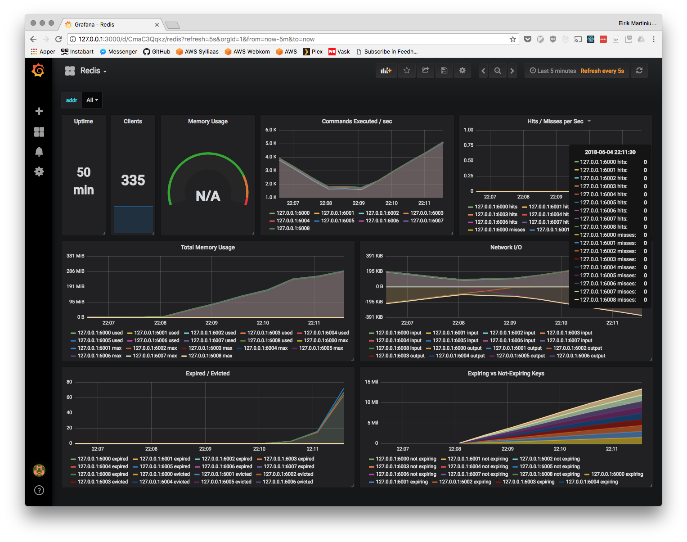

# Apollo [](https://circleci.com/gh/eirsyl/apollo)
> Automatic cluster manager for Redis Cluster

This project is created for educational purposes only, this piece of software
is not production ready.

## Research goal

* Expose cluster metrics for cluster monitoring
* Track cluster incidents within a reasonable time
* Choose a set of incidents and focus on solving each one as fast as possible

## Architecture

The cluster manager consists of multiple services. 

* manager - The primary coordinator service responsible for orchestrating cluster operations
* agent - Metric collector and coordinator for each Redis instance

The agent service runs as a sidecar deployed together with each Redis instance.
Only one manager should run at the time.

## CLI

```
./apollo --help

Apollo is a Redis Cluster manager that aims to lighten the operational burden
on cluster operators. The cluster manager watches the Redis cluster for possible
issues or reduced performance and tries to fix these in the best possible way.

Usage:
  apollo [command]

Available Commands:
  agent       Start the instance agent functionality
  chaos       Apollo test tool used to test the error detection implemented
              in the cluster manager
  help        Help about any command
  manager     Start the cluster manager functionality

Flags:
  -d, --debug     enable debug mode
  -h, --help      help for apollo
      --version   version for apollo

Use "apollo [command] --help" for more information about a command.
```

## Getting started

You need to have the [go toolchain](https://golang.org/doc/install) installed
to build this project.

```
git clone git@github.com:eirsyl/apollo.git $GOPATH/src/github.com/eirsyl/apollo
make
```

The compiled artifact is located in the `bin/` folder.

## Features

Apollo supports the following management tasks:

* Cluster creation
* Open slot
* Slot coverage
* Node addition
* Balance cluster
* Monitoring (prometheus exporter)

## Monitoring

The Apollo agents exposes a set of Redis metrics via the http server. The metrics are located on the `/metrics`
endpoint in the Prometheus metrics format. The `dashboards` folder contains a Grafana dashboard for monitoring
of the Redis nodes.


